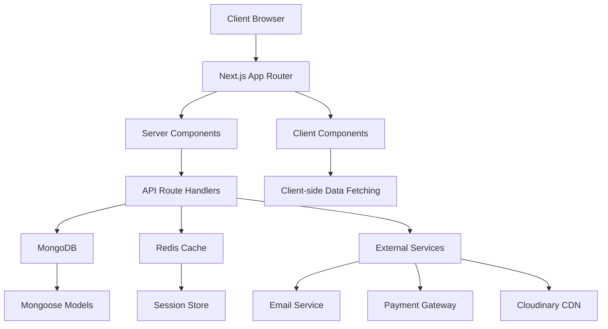
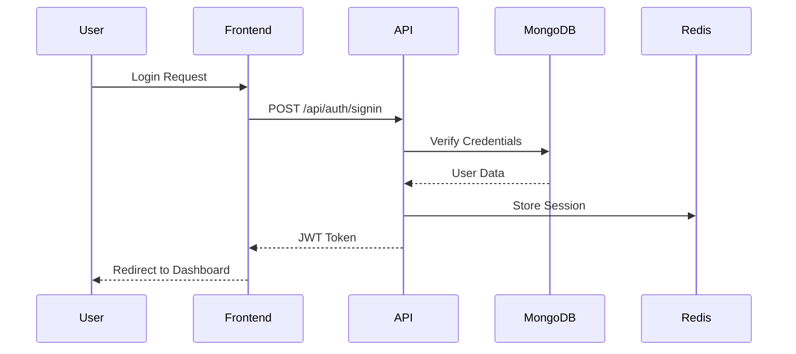
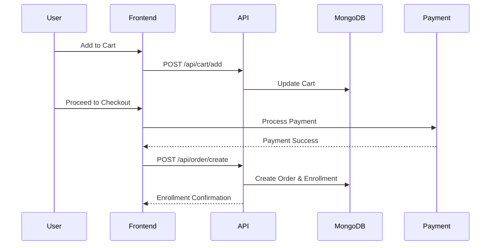
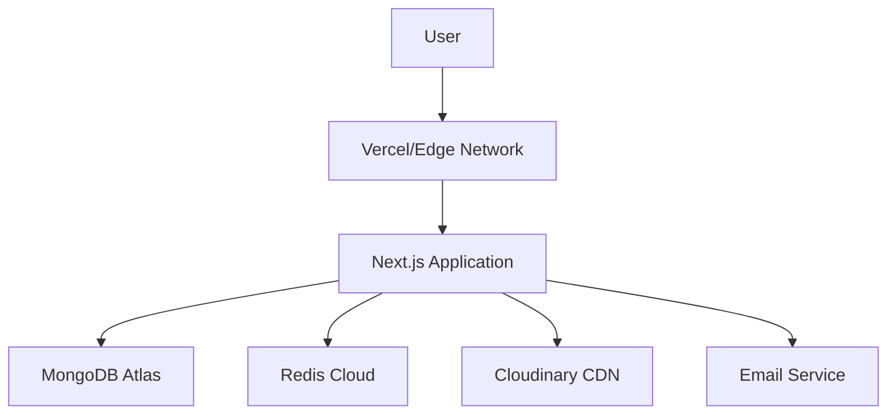
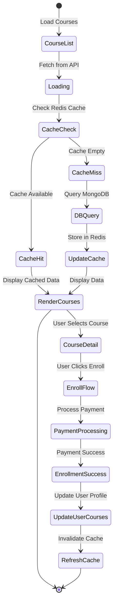
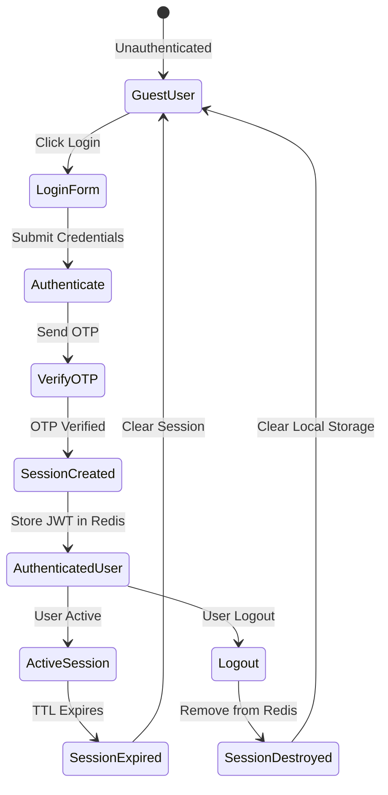
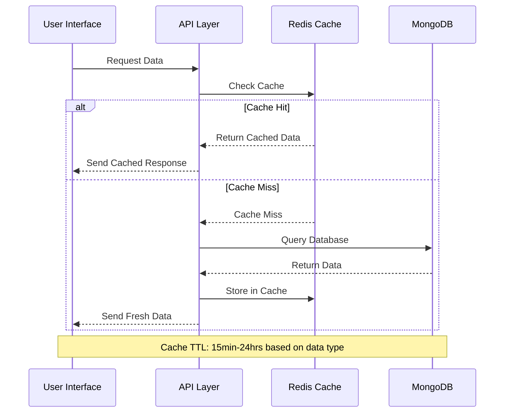

# Learning Management System (LMS) Architecture Document

## 1. System Overview

This Learning Management System (LMS) is a modern, full-stack web application designed to facilitate online education. Built with Next.js 14 using the App Router, it provides a seamless experience for instructors to create and manage courses, and for students to enroll, learn, and track progress.

### Key Features
- **Course Management**: Create, update, and organize courses with multimedia content
- **User Authentication**: Secure login/signup with email verification and OTP
- **Real-time Chat**: Integrated messaging system for student-instructor communication
- **Progress Tracking**: Detailed analytics on course completion and performance
- **Payment Integration**: Secure checkout with order management
- **Admin Dashboard**: Comprehensive admin panel for system management
- **Responsive Design**: Mobile-first approach with dark/light theme support

### Technology Stack
- **Frontend**: Next.js 14 (App Router), React 18, TypeScript
- **Backend**: Next.js API Routes, Node.js
- **Database**: MongoDB with Mongoose ODM
- **Caching**: Redis for session and data caching
- **Authentication**: NextAuth.js with multiple providers
- **Real-time**: Socket.io for chat functionality
- **Styling**: Tailwind CSS with shadcn/ui components
- **Deployment**: Vercel/Netlify with MongoDB Atlas and Redis Cloud

## 2. High-Level Architecture Diagram



## 3. Frontend Architecture

### Pages
The application uses Next.js App Router with the following page structure:

- **Public Pages**:
  - `/` - Homepage with featured courses
  - `/courses` - Course catalog with filtering
  - `/about` - About page
  - `/contact` - Contact form
  - `/login` - Authentication page
  - `/verifyemail` - Email verification

- **Protected Pages**:
  - `/mycourses` - User's enrolled courses
  - `/profile` - User profile management
  - `/cart` - Shopping cart
  - `/checkout` - Payment processing
  - `/orders` - Order history
  - `/chat/[chatId]` - Real-time chat interface

- **Admin Pages**:
  - `/admin/course` - Course management dashboard

### Components
Components are organized in a hierarchical structure:

- **Layout Components**: `Header.tsx`, `Footer.tsx`, `AppSidebar.tsx`
- **UI Components**: Reusable components from shadcn/ui library
- **Feature Components**:
  - `AuthPage/` - Authentication forms
  - `CoursesComp/` - Course listing and details
  - `CartComp/` - Cart functionality
  - `ChatComp/` - Chat interface
  - `AdminComp/` - Admin dashboard components

### State Management
The application uses a combination of state management strategies:

- **Server State**: Next.js Server Components for initial data
- **Client State**: React hooks (`useState`, `useEffect`)
- **Global State**: Custom store using Zustand (inferred from project structure)
- **Form State**: React Hook Form with validation

### Data Fetching Strategy
- **Server Components**: Fetch data on the server for initial page loads
- **Client Components**: Use SWR for client-side data fetching with caching
- **API Routes**: RESTful endpoints for CRUD operations
- **Real-time**: Socket.io for live chat and notifications

```typescript
// Example: Server Component data fetching
export default async function CoursesPage() {
  const courses = await fetchCourses();
  return <CoursesList courses={courses} />;
}

// Example: Client-side data fetching with SWR
import useSWR from 'swr';

function useUserCourses() {
  return useSWR('/api/courses/enrolled', fetcher);
}
```

## 4. Backend Architecture

### API Layer
API routes are organized under `/src/app/api/` with the following structure:

- **Authentication**: `/auth/[...nextauth]`, `/send-otp`, `/verify-otp`
- **Users**: `/users` - User CRUD operations
- **Courses**: `/courses`, `/course/[id]` - Course management
- **Cart**: `/cart` - Shopping cart operations
- **Orders**: `/order` - Payment and order processing
- **Chat**: `/chat`, `/message` - Real-time messaging
- **Progress**: `/progress` - Learning progress tracking

### Business Logic
Business logic is implemented in API route handlers and service layers:

```typescript
// Example: Course enrollment logic
export async function POST(request: Request) {
  const { courseId } = await request.json();
  const userId = getUserIdFromToken(request);
  
  const enrollment = await enrollUserInCourse(userId, courseId);
  return Response.json(enrollment);
}
```

### Models
Mongoose models define the data structure:

- `User` - User accounts and profiles
- `Course` - Course information and content
- `Order` - Purchase transactions
- `Cart` - Shopping cart items
- `Chat` - Chat conversations
- `Message` - Individual messages
- `Progress` - Learning progress tracking

### Services
Service layer handles external integrations:

- **Email Service**: OTP and notification emails
- **Payment Service**: Stripe/Razorpay integration
- **Cloudinary Service**: Media upload and management
- **Redis Service**: Caching and session management

## 5. Database Design

### MongoDB Collections

```javascript
// User Collection
{
  _id: ObjectId,
  name: String,
  email: String,
  password: String, // hashed
  role: ['student', 'instructor', 'admin'],
  profileImage: String,
  isVerified: Boolean,
  enrolledCourses: [ObjectId],
  createdAt: Date,
  updatedAt: Date
}

// Course Collection
{
  _id: ObjectId,
  title: String,
  description: String,
  instructor: ObjectId,
  category: String,
  price: Number,
  thumbnail: String,
  videos: [{
    title: String,
    url: String,
    duration: Number
  }],
  enrolledStudents: [ObjectId],
  rating: Number,
  reviews: [ObjectId],
  createdAt: Date,
  updatedAt: Date
}

// Order Collection
{
  _id: ObjectId,
  user: ObjectId,
  courses: [{
    course: ObjectId,
    price: Number
  }],
  totalAmount: Number,
  status: ['pending', 'completed', 'failed'],
  paymentId: String,
  createdAt: Date
}
```

### Relationships
- **One-to-Many**: User → Courses (enrolled), Course → Users (enrolled students)
- **Many-to-Many**: Users ↔ Courses (enrollment relationship)
- **Embedded**: Course videos, Order items

### Indexing Strategy
```javascript
// User indexes
db.users.createIndex({ email: 1 }, { unique: true });
db.users.createIndex({ role: 1 });

// Course indexes
db.courses.createIndex({ category: 1 });
db.courses.createIndex({ instructor: 1 });
db.courses.createIndex({ title: "text", description: "text" });

// Order indexes
db.orders.createIndex({ user: 1, createdAt: -1 });
db.orders.createIndex({ status: 1 });
```

## 6. Caching Strategy

### Redis Keys
- `user:{id}` - User profile data
- `course:{id}` - Course details
- `courses:list:{page}:{limit}` - Paginated course lists
- `user:courses:{userId}` - User's enrolled courses
- `session:{sessionId}` - NextAuth session data

### TTL Strategy
- **User data**: 1 hour
- **Course data**: 30 minutes
- **Course lists**: 15 minutes
- **Session data**: 24 hours (managed by NextAuth)

### Cache Invalidation
- **On update**: Delete specific keys when data changes
- **On delete**: Remove related cache entries
- **Bulk operations**: Use Redis pipelines for efficiency

```typescript
// Cache invalidation example
async function updateCourse(courseId: string, updates: any) {
  await Course.findByIdAndUpdate(courseId, updates);
  await redis.del(`course:${courseId}`);
  await redis.del('courses:list:*'); // Invalidate all lists
}
```

## 7. Authentication & Authorization

### NextAuth Configuration
```typescript
// auth.ts
export const { handlers, auth, signIn, signOut } = NextAuth({
  providers: [
    CredentialsProvider({
      // Custom credentials logic
    }),
    GoogleProvider({
      clientId: process.env.GOOGLE_CLIENT_ID!,
      clientSecret: process.env.GOOGLE_CLIENT_SECRET!,
    }),
  ],
  session: { strategy: 'jwt' },
  callbacks: {
    jwt: async ({ token, user }) => {
      if (user) token.role = user.role;
      return token;
    },
    session: async ({ session, token }) => {
      session.user.role = token.role;
      return session;
    },
  },
});
```

### Authorization Middleware
```typescript
// middleware.ts
export async function middleware(request: NextRequest) {
  const session = await auth();
  const isAdminRoute = request.nextUrl.pathname.startsWith('/admin');
  
  if (isAdminRoute && session?.user?.role !== 'admin') {
    return NextResponse.redirect(new URL('/login', request.url));
  }
}
```

### Role-Based Access Control
- **Student**: Access enrolled courses, profile, cart, orders
- **Instructor**: Manage own courses, view enrolled students
- **Admin**: Full system access, user management

## 8. Data Flow Diagrams

### User Authentication Flow


### Course Enrollment Flow


## 9. Error Handling & Logging

### Error Handling Strategy
- **Client-side**: React Error Boundaries for UI errors
- **Server-side**: Try-catch blocks in API routes
- **Global**: Custom error handler middleware

```typescript
// API Error Handler
export function errorHandler(error: any) {
  console.error('API Error:', error);
  
  if (error.name === 'ValidationError') {
    return Response.json({ error: 'Invalid input data' }, { status: 400 });
  }
  
  if (error.name === 'CastError') {
    return Response.json({ error: 'Invalid ID format' }, { status: 400 });
  }
  
  return Response.json({ error: 'Internal server error' }, { status: 500 });
}
```

### Logging
- **Morgan**: HTTP request logging
- **Winston**: Structured logging for errors and events
- **Log Levels**: error, warn, info, debug

## 10. Performance Optimizations

### Frontend Optimizations
- **Code Splitting**: Dynamic imports for route-based splitting
- **Image Optimization**: Next.js Image component with lazy loading
- **Bundle Analysis**: Webpack bundle analyzer
- **Caching**: SWR for client-side caching

### Backend Optimizations
- **Database Indexing**: Optimized queries with proper indexes
- **Redis Caching**: Reduce database load for frequently accessed data
- **Pagination**: Limit data transfer for large datasets
- **Compression**: Gzip compression for API responses

### Database Optimizations
- **Aggregation Pipelines**: Efficient data processing
- **Read Preferences**: Distribute read operations
- **Connection Pooling**: Reuse database connections

## 11. Security Best Practices

### Authentication Security
- **Password Hashing**: bcrypt with salt rounds
- **JWT Tokens**: Secure token generation with expiration
- **Session Management**: Secure cookie settings

### API Security
- **Input Validation**: Zod schemas for request validation
- **Rate Limiting**: Prevent abuse with request throttling
- **CORS**: Configured for allowed origins
- **Helmet**: Security headers

### Data Protection
- **Encryption**: Sensitive data encryption at rest
- **HTTPS**: SSL/TLS for all communications
- **Environment Variables**: Secure configuration management

## 12. Scalability Considerations

### Horizontal Scaling
- **Stateless Design**: API routes don't rely on local state
- **Database Sharding**: Distribute data across multiple MongoDB instances
- **Redis Clustering**: Scale cache layer horizontally

### Vertical Scaling
- **Resource Optimization**: Efficient memory and CPU usage
- **CDN Integration**: Cloudinary for media assets
- **Load Balancing**: Distribute traffic across multiple instances

### Monitoring
- **Performance Metrics**: Response times, error rates
- **Database Monitoring**: Query performance, connection pools
- **Cache Hit Rates**: Monitor Redis effectiveness

## 13. Folder Structure

```
src/
├── app/                    # Next.js App Router
│   ├── api/               # API route handlers
│   ├── (admin)/           # Admin routes
│   ├── cart/              # Cart page
│   ├── chat/              # Chat pages
│   ├── components/        # Page-specific components
│   ├── globals.css        # Global styles
│   ├── layout.tsx         # Root layout
│   └── page.tsx           # Homepage
├── components/            # Shared components
│   ├── ui/               # UI library components
│   └── VideoPlayer/      # Custom video player
├── lib/                  # Utility libraries
│   ├── utils.ts          # General utilities
│   └── helpers/          # Helper functions
├── models/               # Mongoose models
├── services/             # External service integrations
├── types/                # TypeScript type definitions
└── utils/                # Utility functions
```

## 14. Deployment Architecture

### Production Environment


### CI/CD Pipeline
- **GitHub Actions**: Automated testing and deployment
- **Environment Variables**: Secure secret management
- **Database Migrations**: Automated schema updates
- **Rollback Strategy**: Quick deployment reversals

### Monitoring & Analytics
- **Vercel Analytics**: Performance and usage metrics
- **MongoDB Atlas**: Database monitoring
- **Redis Insights**: Cache performance analysis

## 15. Future Improvements

### Planned Features
- **Mobile App**: React Native companion app
- **Video Conferencing**: Integrated live sessions
- **Gamification**: Badges, leaderboards, and achievements
- **AI Recommendations**: Personalized course suggestions
- **Advanced Analytics**: Detailed learning insights

### Technical Improvements
- **Microservices**: Break down monolithic structure
- **GraphQL**: More flexible API layer
- **Real-time Notifications**: Push notifications
- **Offline Support**: PWA capabilities
- **Multi-tenancy**: Support for multiple organizations

---

## Detailed State-Flow Section

### UI State Connections

The application manages complex state flows connecting user interface states with backend services, caching layers, and persistent storage.

#### Course Management Flow



#### User Session Lifecycle



#### Cache Hit/Miss Scenarios



### State Management Integration

```typescript
// Zustand store example
interface AppState {
  user: User | null;
  courses: Course[];
  cart: CartItem[];
  isLoading: boolean;
  error: string | null;
  
  // Actions
  setUser: (user: User) => void;
  addToCart: (course: Course) => void;
  enrollCourse: (courseId: string) => Promise<void>;
  clearError: () => void;
}

export const useAppStore = create<AppState>((set, get) => ({
  user: null,
  courses: [],
  cart: [],
  isLoading: false,
  error: null,
  
  setUser: (user) => set({ user }),
  
  addToCart: (course) => {
    const cart = get().cart;
    set({ cart: [...cart, { course, quantity: 1 }] });
  },
  
  enrollCourse: async (courseId) => {
    set({ isLoading: true, error: null });
    try {
      const response = await fetch('/api/course/enroll', {
        method: 'POST',
        body: JSON.stringify({ courseId }),
      });
      
      if (!response.ok) throw new Error('Enrollment failed');
      
      // Update local state
      const user = get().user;
      if (user) {
        set({ 
          user: { 
            ...user, 
            enrolledCourses: [...user.enrolledCourses, courseId] 
          }
        });
      }
    } catch (error) {
      set({ error: error.message });
    } finally {
      set({ isLoading: false });
    }
  },
  
  clearError: () => set({ error: null }),
}));
```

This architecture document provides a comprehensive overview of the LMS system, ensuring scalability, maintainability, and excellent user experience. The modular design allows for easy extension and modification as the system grows.
